# Deployment Architecture

## Overview

This document describes the deployment architecture for Huginn, including supported platforms, deployment modes, system requirements, and operational considerations.

## Deployment Modes

Huginn supports multiple deployment modes to accommodate different use cases:


### Standalone CLI Mode

The primary deployment mode for interactive use.


**Characteristics:**
- Single execution per invocation
- Configuration from files or CLI arguments
- Results output to stdout or file
- No persistent state
- Suitable for ad-hoc scanning

**Typical Usage:**
```bash
# Quick scan
huginn scan 192.168.1.0/24 -t ping,tcp_connect

# Detailed scan with output
huginn scan -T targets.txt -t all -o results.json -f json
```

### System Service Mode (Future)

Background service for continuous operation.


**Characteristics:**
- Long-running daemon process
- REST API for control
- Job scheduling support
- Result persistence
- Web dashboard for monitoring

**Service Management:**
```bash
# systemd service
sudo systemctl start huginn
sudo systemctl enable huginn
sudo systemctl status huginn

# Service API
curl http://localhost:8080/api/scan -d '{"target": "192.168.1.1"}'
```

### Containerized Deployment

Docker/Podman containers for isolated execution.


**Characteristics:**
- Isolated environment
- Reproducible builds
- Easy deployment
- Resource constraints
- Network mode configuration

**Example Dockerfile:**
```dockerfile
FROM rust:1.89-slim as builder
WORKDIR /app
COPY . .
RUN cargo build --release

FROM debian:bookworm-slim
RUN apt-get update && apt-get install -y \
    libcap2-bin ca-certificates \
    && rm -rf /var/lib/apt/lists/*
COPY --from=builder /app/target/release/huginn /usr/local/bin/
ENTRYPOINT ["huginn"]
```

**Container Usage:**
```bash
# Run with Docker
docker run -v $(pwd)/config:/config \
    -v $(pwd)/results:/results \
    --network=host \
    huginn:latest scan -T /config/targets.txt

# Docker Compose
docker-compose up -d
```

## Platform Support

### Linux (Primary Platform)


**Support Level:** ✅ Full Support

**Features:**
- All scan types supported
- Linux capabilities for privilege management
- Native binary packages
- Systemd service integration

**System Requirements:**
- Kernel: 3.10+ (recommended 5.0+)
- glibc: 2.28+ or musl
- Architecture: x86_64, ARM64

**Installation:**
```bash
# From package manager (future)
apt-get install huginn
dnf install huginn
pacman -S huginn

# From binary release
wget https://github.com/.../huginn-linux-x86_64.tar.gz
tar xzf huginn-linux-x86_64.tar.gz
sudo install -m 755 huginn /usr/local/bin/

# Set capabilities for privileged scans
sudo setcap cap_net_raw+ep /usr/local/bin/huginn
```

### Windows/WSL


**Support Level:** 🟡 Limited (WSL), ⏳ Future (Native)

**WSL Support:**
- Run Linux binary in WSL 2
- Most features available
- Some privilege limitations

**Native Windows:**
- TCP Connect scans work
- Raw socket support limited
- Future: Winsock raw socket support

**Installation (WSL):**
```bash
# In WSL 2
wsl --install
# Then follow Linux installation
```

### macOS


**Support Level:** ⏳ Testing

**Features:**
- Cross-compiled ARM64 and x86_64 binaries
- BPF device access for raw packets
- Universal binary support planned

**System Requirements:**
- macOS 11 Big Sur or later
- Apple Silicon (M1/M2/M3) or Intel

**Installation:**
```bash
# Homebrew (future)
brew install huginn

# From binary
curl -LO https://github.com/.../huginn-darwin-universal.tar.gz
tar xzf huginn-darwin-universal.tar.gz
sudo install -m 755 huginn /usr/local/bin/
```

### BSD Systems

**Support Level:** ⏳ Community Testing

**Distributions:**
- FreeBSD
- OpenBSD
- NetBSD

**Status:**
- Basic functionality should work
- Community testing needed
- Platform-specific adjustments may be required

## System Architecture

### Single-Host Deployment


### Multi-Instance Deployment (Future)


## Network Configuration

### Network Access Requirements


**Required Outbound Access:**
- ICMP: Echo requests (type 8) for ping scans
- TCP: Destination ports as configured
- UDP: Destination ports as configured
- DNS: Port 53 for name resolution

**Firewall Considerations:**
- Allow ICMP echo requests and replies
- Allow TCP connections to scan ports
- Allow UDP packets to scan ports
- Consider rate limiting for large scans

### Network Topologies

**Direct Scanning:**


**Scanning Through Jump Host:**


**Distributed Scanning (Future):**


## Resource Requirements

### Minimum Requirements

| Resource | Minimum | Recommended |
|----------|---------|-------------|
| CPU | 1 core | 2+ cores |
| Memory | 256 MB | 1 GB |
| Disk Space | 50 MB | 100 MB |
| Network | 1 Mbps | 10+ Mbps |

### Scaling Guidelines


**Resource Calculation:**
- Memory: ~1 MB per concurrent scan + base overhead
- CPU: Minimal for I/O-bound operations
- Network: Depends on scan types and targets
- Disk: Results storage varies by target count

## Storage Architecture

### File System Layout

```
/usr/local/bin/
    huginn                   # Binary executable

/etc/huginn/
    config.json             # System-wide configuration
    targets.txt             # Default target lists

/var/lib/huginn/
    results/                # Scan results
    cache/                  # Cached data (DNS, etc.)

/var/log/huginn/
    huginn.log             # Application logs
    audit.log              # Audit trail

/home/user/.config/huginn/
    config.json            # User configuration
    credentials            # User credentials (mode 0600)
```

### Result Storage


## Security Architecture

### Privilege Management

```mermaid
graph TB
    subgraph "Execution Modes"
        User[User Mode<br/>No privileges]
        Capabilities[Capabilities<br/>CAP_NET_RAW]
        Root[Root Mode<br/>Full privileges]
    end
    
    subgraph "Scan Types"
        TCP[TCP Connect<br/>✓ User mode]
        UDP[UDP Scan<br/>✓ User mode]
        ICMP[ICMP Ping<br/>⚠ Capabilities]
        SYN[SYN Scan<br/>⚠ Capabilities]
    end
    
    User --> TCP
    User --> UDP
    Capabilities --> ICMP
    Capabilities --> SYN
    Root --> ICMP
    Root --> SYN
```



**Recommended Setup:**
```bash
# Grant capabilities (Linux)
sudo setcap cap_net_raw+ep /usr/local/bin/huginn

# Verify capabilities
getcap /usr/local/bin/huginn

# Create dedicated user (service mode)
sudo useradd -r -s /bin/false -d /var/lib/huginn huginn
```

### System Hardening


## Service Management

### Systemd Service (Linux)

```ini
# /etc/systemd/system/huginn.service
[Unit]
Description=Huginn Cyber Threat Scanner
After=network-online.target
Wants=network-online.target

[Service]
Type=simple
User=huginn
Group=huginn
WorkingDirectory=/var/lib/huginn
ExecStart=/usr/local/bin/huginn daemon --config /etc/huginn/config.json
Restart=on-failure
RestartSec=10

# Security hardening
PrivateTmp=yes
NoNewPrivileges=yes
ProtectSystem=strict
ProtectHome=yes
ReadWritePaths=/var/lib/huginn /var/log/huginn

# Capabilities
AmbientCapabilities=CAP_NET_RAW
CapabilityBoundingSet=CAP_NET_RAW

[Install]
WantedBy=multi-user.target
```

**Service Management:**
```bash
# Enable and start
sudo systemctl daemon-reload
sudo systemctl enable huginn
sudo systemctl start huginn

# Check status
sudo systemctl status huginn
sudo journalctl -u huginn -f

# Stop and disable
sudo systemctl stop huginn
sudo systemctl disable huginn
```

## Monitoring and Observability

### Metrics Collection


### Health Checks

```bash
# CLI health check
huginn --version

# Service health check (future)
curl http://localhost:8080/health

# Expected response
{
    "status": "healthy",
    "version": "0.1.0",
    "uptime_seconds": 3600
}
```

## Backup and Recovery

### Configuration Backup

```bash
# Backup configuration
tar czf huginn-config-$(date +%Y%m%d).tar.gz \
    /etc/huginn \
    /home/*/.config/huginn

# Restore configuration
tar xzf huginn-config-20240101.tar.gz -C /
```

### Result Archival

```bash
# Archive old results
find /var/lib/huginn/results -mtime +30 -exec gzip {} \;

# Move to archive
mv /var/lib/huginn/results/*.gz /var/lib/huginn/archive/
```

## Disaster Recovery

### Recovery Procedures

1. **Configuration Loss:**
   - Restore from backup
   - Regenerate from templates
   - Validate configuration

2. **Service Failure:**
   - Check service logs
   - Verify permissions and capabilities
   - Restart service
   - Escalate if persistent

3. **Data Corruption:**
   - Stop service
   - Restore from backup
   - Verify data integrity
   - Resume operations

## Migration Guide

### Upgrading Huginn

```bash
# Stop service
sudo systemctl stop huginn

# Backup current installation
sudo cp /usr/local/bin/huginn /usr/local/bin/huginn.backup

# Install new version
sudo install -m 755 huginn-new /usr/local/bin/huginn

# Update capabilities
sudo setcap cap_net_raw+ep /usr/local/bin/huginn

# Start service
sudo systemctl start huginn

# Verify
huginn --version
sudo systemctl status huginn
```

### Configuration Migration

```bash
# Check for config changes
huginn --check-config /etc/huginn/config.json

# Migrate if needed
huginn migrate-config /etc/huginn/config.json
```

## Performance Tuning

### System Tuning

```bash
# Increase file descriptor limits
ulimit -n 65536

# Kernel parameters for high-performance scanning
sudo sysctl -w net.ipv4.ip_local_port_range="1024 65535"
sudo sysctl -w net.core.somaxconn=65535
sudo sysctl -w net.ipv4.tcp_max_syn_backlog=65535
```

### Application Tuning

```json
{
    "concurrency": 50,
    "timeout": 10,
    "rate_limit": 1000,
    "buffer_size": 8192
}
```

## Summary

The Huginn deployment architecture provides:

- **Flexibility**: Multiple deployment modes for different use cases
- **Scalability**: From single host to distributed deployments
- **Security**: Comprehensive security hardening and privilege management
- **Reliability**: Service management and monitoring capabilities
- **Portability**: Support for multiple platforms and architectures

This architecture supports current needs while providing a path for future enhancements and scaling.
