# Plugin System Architecture

## Overview

The Huginn plugin system provides a flexible, type-safe mechanism for implementing different types of network security scans. This document details the architecture, interfaces, and lifecycle of the plugin system.

## Plugin System Design

### Core Concepts

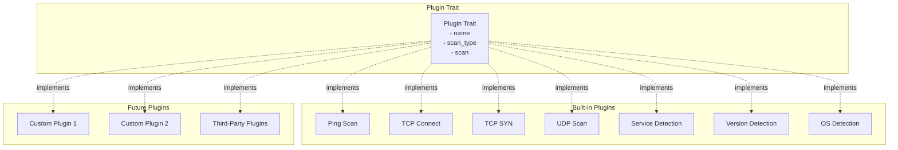

## Plugin Trait Interface

### Trait Definition

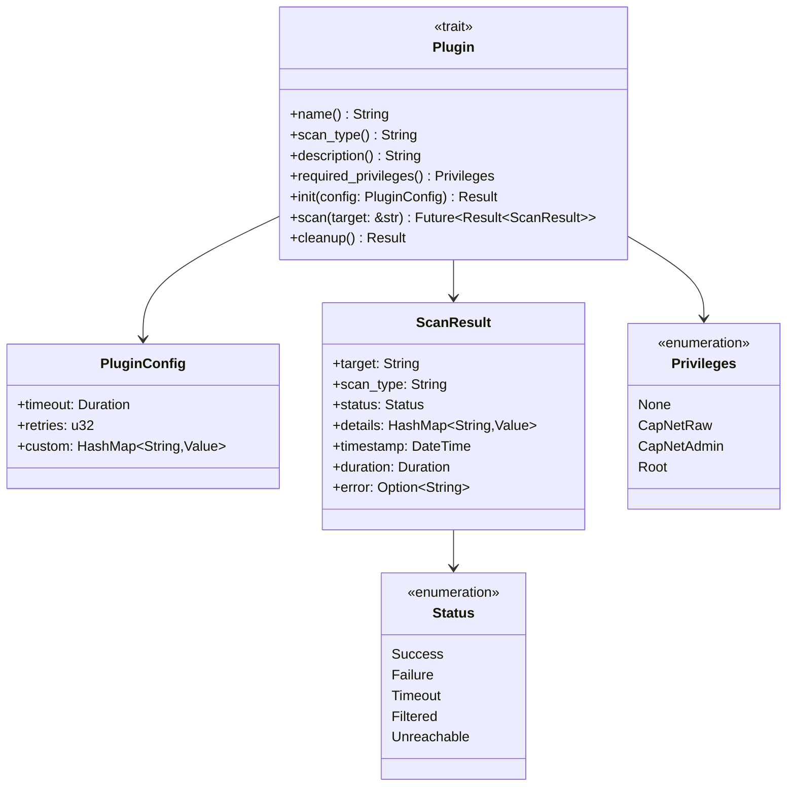

### Trait Methods

**Required Methods:**

- `name()`: Returns unique plugin identifier
- `scan_type()`: Returns scan type name for user selection
- `scan(target)`: Performs the actual scan operation (async)

**Optional Methods (with defaults):**

- `description()`: Returns human-readable description
- `required_privileges()`: Returns privilege requirements
- `init(config)`: Initialize plugin with configuration
- `cleanup()`: Clean up plugin resources

## Plugin Lifecycle

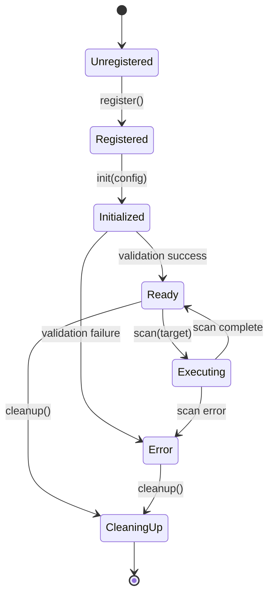

### Lifecycle Stages

1. **Unregistered**: Plugin struct created but not registered
2. **Registered**: Plugin registered with PluginManager
3. **Initialized**: Plugin initialized with configuration
4. **Ready**: Plugin ready to perform scans
5. **Executing**: Plugin actively scanning target
6. **CleaningUp**: Plugin releasing resources
7. **Error**: Plugin encountered error

## Plugin Registration

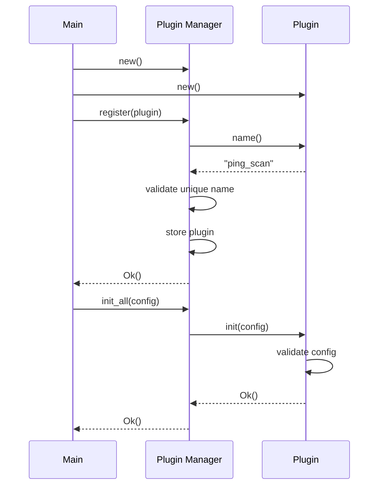

## Plugin Execution

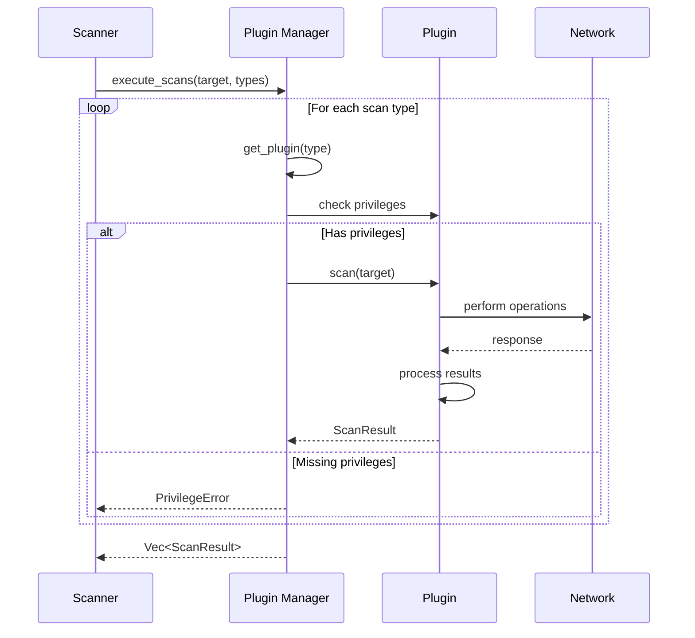

## Built-in Plugin Implementations

### Ping Scan Plugin

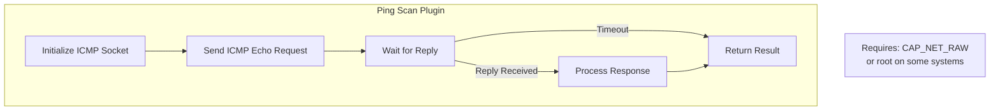

**Features:**
- ICMP echo request/reply
- Configurable timeout
- Latency measurement
- Fallback to TCP ping if ICMP unavailable

### TCP Connect Scan Plugin

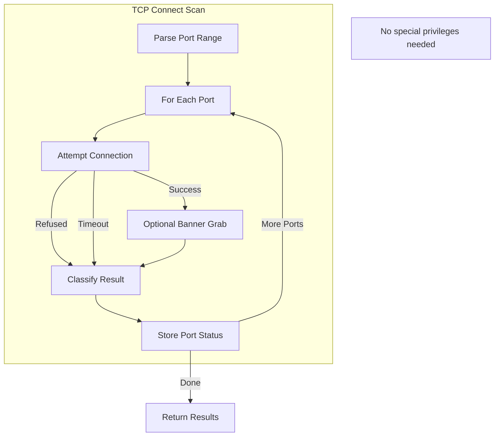

**Features:**
- Full TCP three-way handshake
- Port range scanning
- Service banner grabbing
- Connection timeout
- No special privileges required

### TCP SYN Scan Plugin

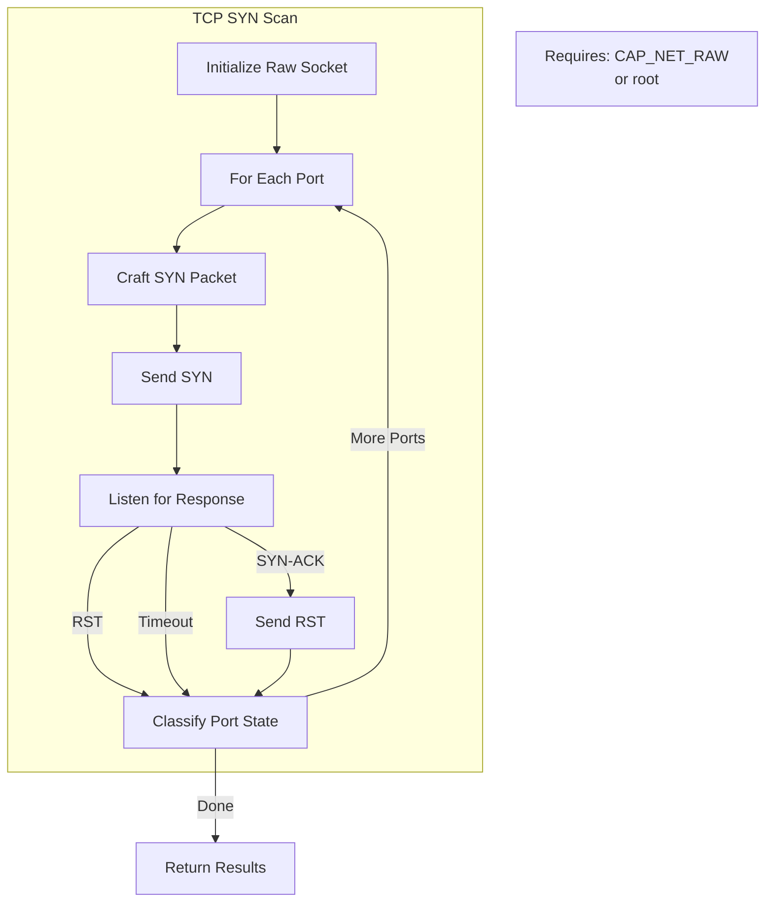

**Features:**
- Stealth scanning (no full connection)
- Raw socket operations
- Port state classification
- Requires elevated privileges

### UDP Scan Plugin

```mermaid
graph TB
    subgraph "UDP Scan"
        Loop[For Each Port]
        Send[Send UDP Packet]
        Listen[Listen for Response]
        CheckICMP[Check ICMP Errors]
        Classify[Classify State]
    end
    
    Loop --> Send
    Send --> Listen
    Listen -->|UDP Reply| Classify
    Listen -->|Timeout| CheckICMP
    CheckICMP -->|Port Unreachable| Classify
    CheckICMP -->|No Error| Classify
    Classify -->|More Ports| Loop
    Classify -->|Done| Result[Return Results]
    
    Note1[Open|Filtered distinction<br/>often difficult]
```

**Features:**
- UDP packet sending
- ICMP error detection
- Protocol-specific probes
- Timeout-based detection

## Plugin Configuration

### Configuration Structure

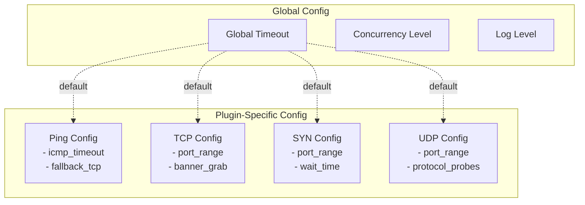

### Configuration Inheritance

- Global settings provide defaults
- Plugin-specific config overrides globals
- CLI arguments override all config
- Validation ensures compatibility

## Plugin Error Handling

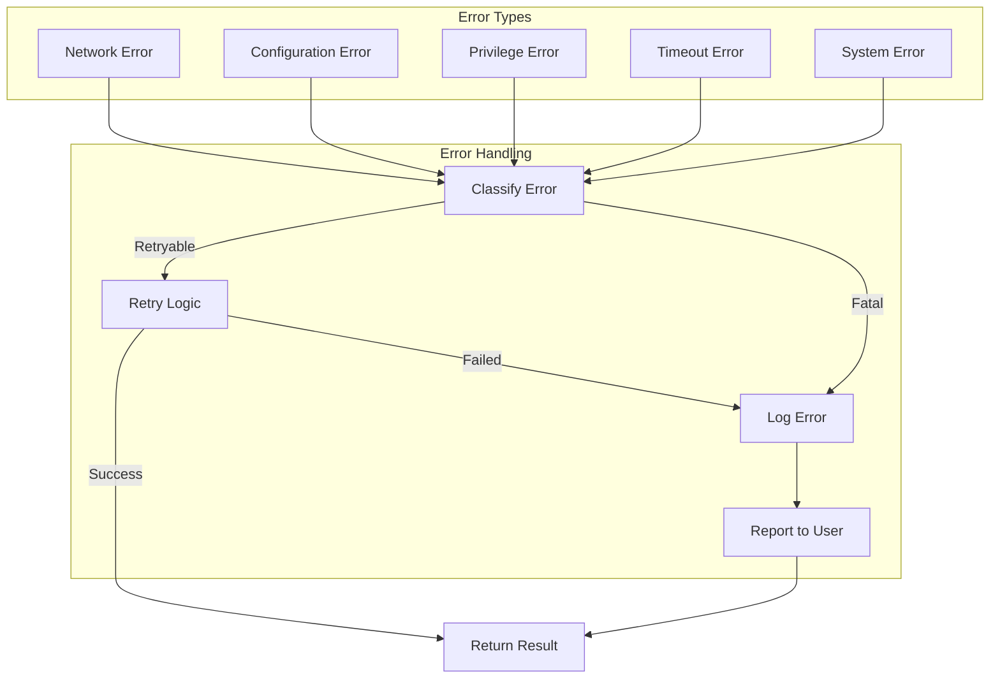

### Error Categories

**Retryable Errors:**
- Temporary network failures
- DNS resolution timeouts
- Connection resets

**Fatal Errors:**
- Missing privileges
- Invalid configuration
- System resource exhaustion
- Invalid target format

## Plugin Result Format

### ScanResult Structure

```rust
pub struct ScanResult {
    pub target: String,           // IP or hostname
    pub scan_type: String,         // Type of scan performed
    pub status: Status,            // Overall status
    pub details: HashMap<String, Value>, // Plugin-specific data
    pub timestamp: DateTime<Utc>,  // When scan started
    pub duration: Duration,        // How long scan took
    pub error: Option<String>,     // Error message if failed
}
```

### Details Field Examples

**Ping Scan:**
```json
{
    "alive": true,
    "latency_ms": 12.5,
    "method": "icmp"
}
```

**TCP Connect Scan:**
```json
{
    "open_ports": [22, 80, 443],
    "closed_ports": [25, 3306],
    "filtered_ports": [],
    "banners": {
        "80": "Apache/2.4.41"
    }
}
```

**Service Detection:**
```json
{
    "port": 80,
    "service": "http",
    "product": "Apache httpd",
    "version": "2.4.41",
    "os_cpe": "cpe:/o:linux:linux_kernel"
}
```

## Plugin Testing Framework

### Test Structure

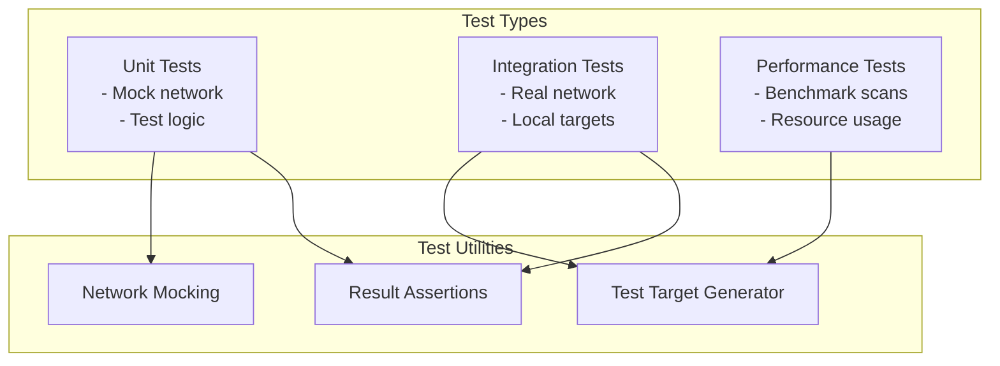

### Mock Target System

```rust
// Example test setup
#[cfg(test)]
mod tests {
    use super::*;
    
    #[tokio::test]
    async fn test_ping_scan_success() {
        let plugin = PingScanPlugin::new();
        let result = plugin.scan("127.0.0.1").await.unwrap();
        
        assert_eq!(result.status, Status::Success);
        assert_eq!(result.scan_type, "ping");
        assert!(result.details.contains_key("alive"));
    }
}
```

## Plugin Development Guide

### Creating a New Plugin

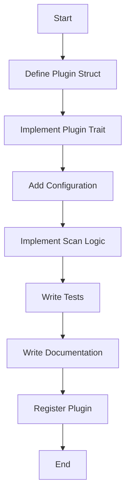

### Plugin Checklist

- [ ] Define plugin struct with necessary fields
- [ ] Implement all required Plugin trait methods
- [ ] Handle errors gracefully
- [ ] Support async operations
- [ ] Add configuration validation
- [ ] Implement timeout handling
- [ ] Write unit tests
- [ ] Write integration tests
- [ ] Document configuration options
- [ ] Document required privileges
- [ ] Add usage examples
- [ ] Register with PluginManager

## Security Considerations

### Privilege Management

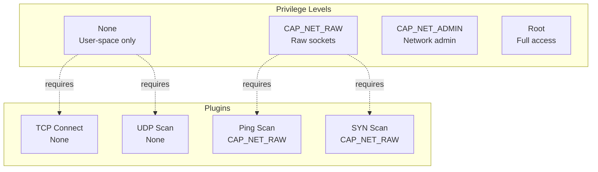

### Input Validation

All plugins must validate:
- Target format (IP, hostname, range)
- Port ranges (1-65535)
- Configuration values
- Network responses

### Resource Limits

Plugins must respect:
- Timeout configurations
- Memory limits
- File descriptor limits
- Network bandwidth limits

## Performance Optimization

### Concurrency

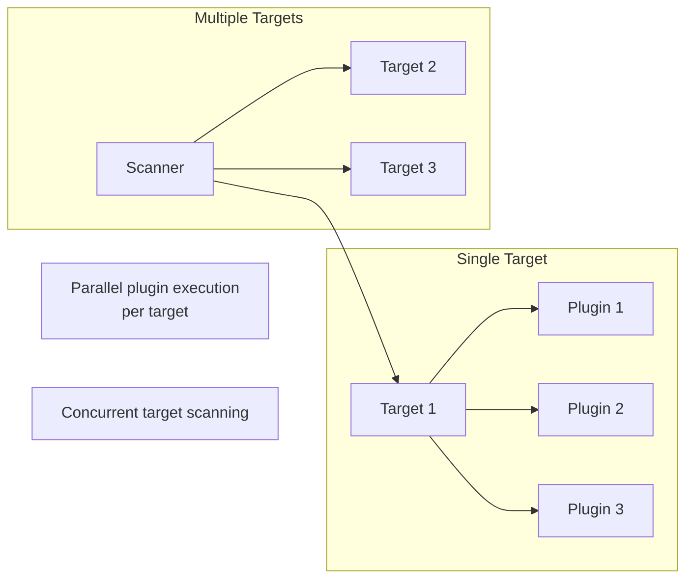

### Optimization Strategies

1. **Connection Pooling**: Reuse connections where possible
2. **Batching**: Group operations for efficiency
3. **Caching**: Cache DNS lookups and results
4. **Early Exit**: Stop on definitive results
5. **Resource Sharing**: Share resources between plugins

## Future Enhancements

### Planned Features

1. **Dynamic Plugin Loading**
   - Load plugins from shared libraries
   - Hot-reload capabilities
   - Plugin versioning

2. **Plugin Marketplace**
   - Plugin discovery service
   - Third-party plugin repository
   - Plugin ratings and reviews

3. **Advanced Plugin Types**
   - Credential testing plugins
   - Vulnerability scanning plugins
   - Compliance checking plugins

4. **Plugin Composition**
   - Chain multiple plugins
   - Conditional execution
   - Plugin dependencies

## Summary

The Huginn plugin system provides:

- **Type Safety**: Rust trait system ensures correctness
- **Flexibility**: Easy to add new scan types
- **Performance**: Async I/O for high throughput
- **Security**: Privilege management and input validation
- **Testability**: Comprehensive testing framework
- **Documentation**: Clear interfaces and examples

This architecture enables both built-in and custom plugins while maintaining safety, performance, and maintainability.
