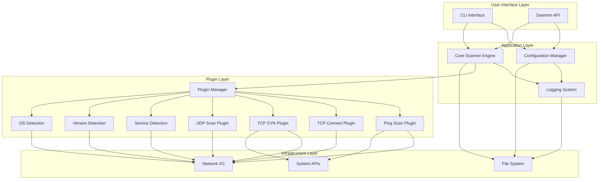
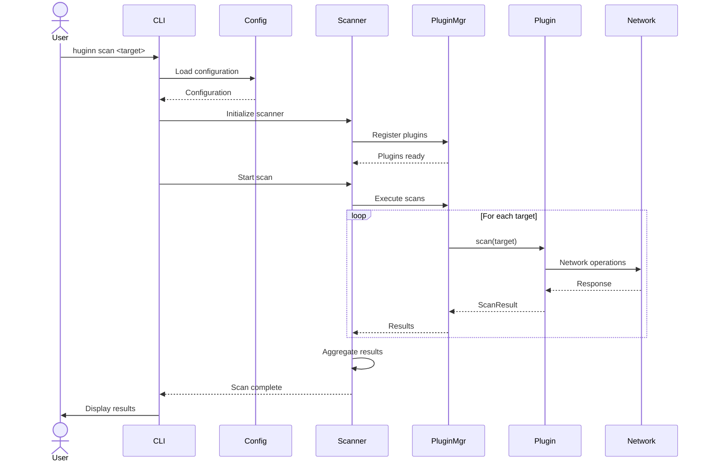
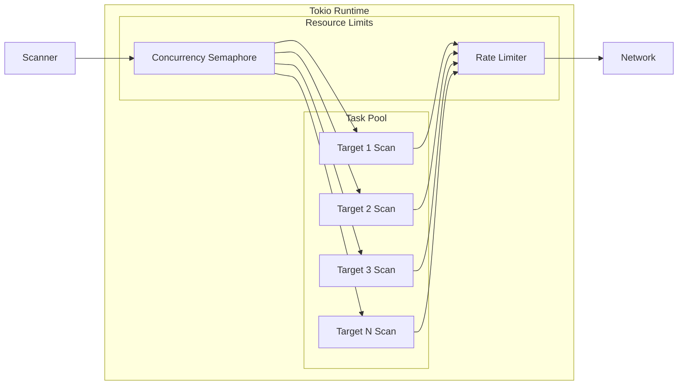
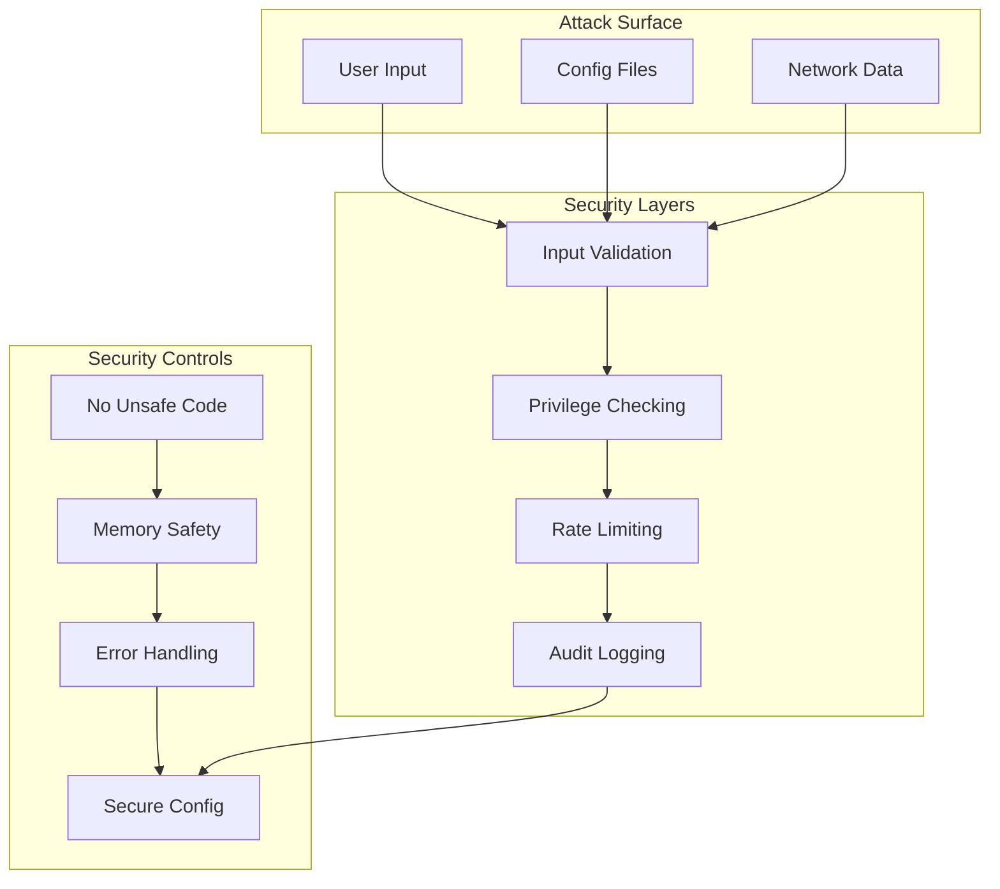
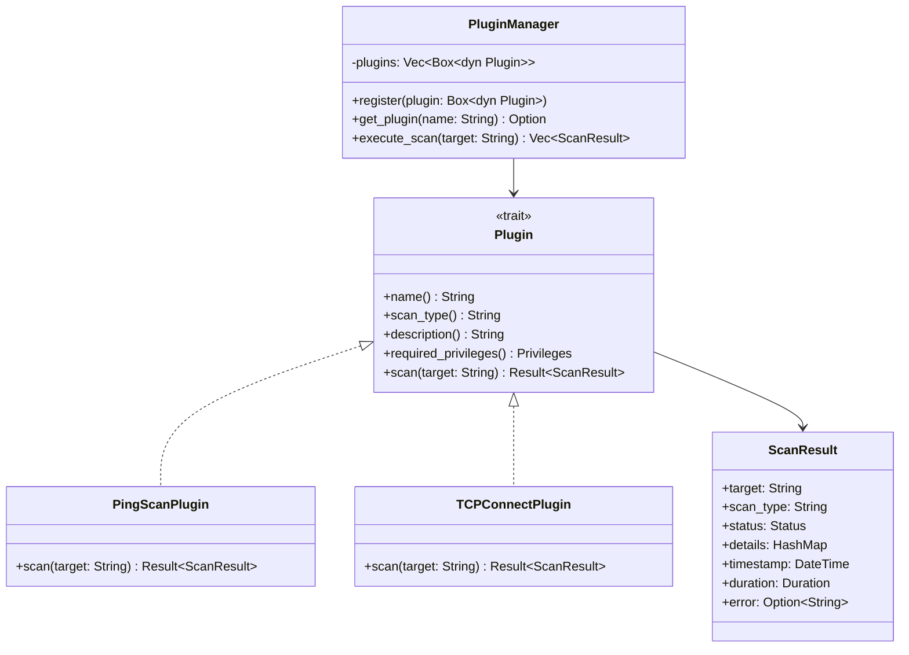
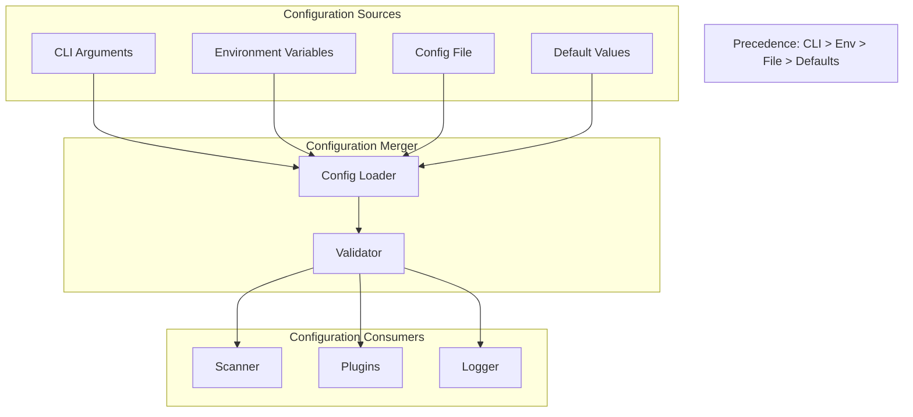
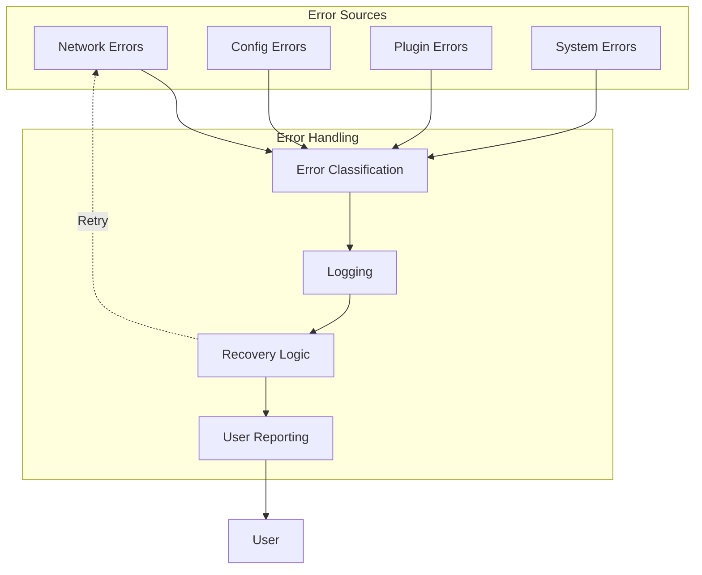
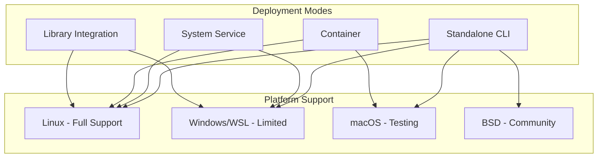

# System Architecture

## Overview

This document provides a comprehensive view of the Huginn cyber threat scanning toolkit architecture. Huginn is designed as a modular, plugin-based system built on Rust 2024 edition with a focus on safety, performance, and extensibility.

## High-Level Architecture

The system follows a layered architecture with clear separation of concerns:

## Component Descriptions

### User Interface Layer

**CLI Interface**
- Command-line interface for interactive use
- Parses arguments and flags
- Displays progress and results
- Handles user input validation

**Daemon API** (Future)
- HTTP/REST API for programmatic access
- Enables daemon mode operation
- Supports scheduling and automation
- Provides status and control endpoints

### Application Layer

**Configuration Manager**
- Loads configuration from multiple sources (files, env vars, CLI)
- Merges configuration with proper precedence
- Validates configuration before use
- Provides configuration to all components

**Core Scanner Engine**
- Orchestrates scan operations
- Manages concurrency and resource limits
- Coordinates plugin execution
- Aggregates and formats results
- Handles errors and retries

**Logging System**
- Structured logging with multiple levels
- Configurable output destinations
- Supports file and console output
- Provides audit trail for security events

### Plugin Layer

**Plugin Manager**
- Registers and discovers plugins
- Routes scan requests to appropriate plugins
- Manages plugin lifecycle
- Validates plugin compatibility

**Scan Plugins**
- Implement specific scan types
- Follow common Plugin trait interface
- Execute asynchronously via Tokio
- Return structured results

### Infrastructure Layer

**Network I/O**
- Async TCP/UDP socket operations via Tokio
- DNS resolution
- Raw socket operations (privileged scans)
- Connection pooling and management

**File System**
- Configuration file reading
- Result output writing
- Log file management
- Permission checking

**System APIs**
- Privilege checking and management
- Signal handling
- Resource limit enforcement
- Platform-specific capabilities

## Data Flow

### Typical Scan Operation Flow

## Concurrency Model

The system uses Tokio's async runtime for concurrent operations:

**Concurrency Controls:**
- Semaphore limits concurrent tasks
- Rate limiter prevents network flooding
- Timeouts enforce maximum operation duration
- Graceful shutdown on cancellation

## Security Architecture

**Security Principles:**
- Defense in depth with multiple layers
- Principle of least privilege
- Input validation at all boundaries
- Comprehensive audit logging
- Memory safety guaranteed by Rust

## Plugin Architecture Detail

## Configuration Architecture

**Configuration Precedence:**
1. CLI arguments (highest priority)
2. Environment variables
3. Configuration file
4. Default values (lowest priority)

## Error Handling Architecture

**Error Handling Strategy:**
- Classify errors by type and severity
- Log all errors with context
- Attempt recovery for transient errors
- Provide clear messages to users
- Never panic in production code

## Deployment Architecture

## Technology Stack

### Core Technologies

| Component | Technology | Version | Purpose |
|-----------|-----------|---------|----------|
| Language | Rust | 2024 edition | Memory-safe systems programming |
| Async Runtime | Tokio | 1.41+ | Asynchronous I/O and concurrency |
| CLI Parsing | Clap | TBD | Command-line argument parsing |
| Configuration | config-rs | 0.15+ | Multi-source configuration |
| Serialization | Serde | 1.0+ | Data serialization/deserialization |
| Logging | log + fern | 0.4+ / 0.7+ | Structured logging |

### Development Tools

| Tool | Purpose |
|------|---------|
| cargo | Build system and package manager |
| rustfmt | Code formatting |
| clippy | Linting and code quality |
| cargo-audit | Security vulnerability scanning |
| cargo-tarpaulin | Code coverage analysis |
| cargo-fuzz | Fuzz testing (future) |

## Design Patterns

### Observer Pattern
- Plugin registration and discovery
- Event notification for scan progress

### Strategy Pattern
- Different scan types as strategies
- Pluggable output formatters

### Factory Pattern
- Plugin instantiation
- Configuration object creation

### Chain of Responsibility
- Configuration source precedence
- Error handling and recovery

## Scalability Considerations

### Horizontal Scalability
- Distributed scanning (future)
- Multiple scanner instances
- Load balancing (daemon mode)

### Vertical Scalability
- Configurable concurrency levels
- Resource pooling
- Efficient memory usage

## Future Architecture Extensions

### Planned Features

1. **Daemon Mode**
   - HTTP REST API
   - Job scheduling
   - Result persistence
   - Web dashboard

2. **Distributed Scanning**
   - Master-worker architecture
   - Result aggregation
   - Coordination service

3. **Plugin Marketplace**
   - Plugin discovery
   - Third-party plugins
   - Plugin versioning

4. **Integration APIs**
   - SIEM integration
   - CI/CD integration
   - Webhook notifications

## Summary

The Huginn architecture is designed for:
- **Safety**: Memory-safe Rust with no unsafe code
- **Performance**: Async I/O with Tokio for high throughput
- **Extensibility**: Plugin-based architecture for new scan types
- **Maintainability**: Clear separation of concerns and well-documented interfaces
- **Security**: Defense in depth with multiple security layers

This architecture provides a solid foundation for current functionality while enabling future enhancements and scaling.
